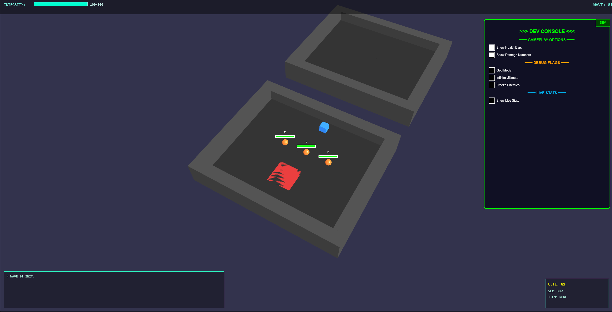
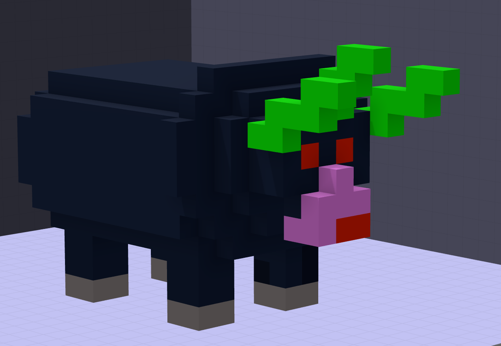
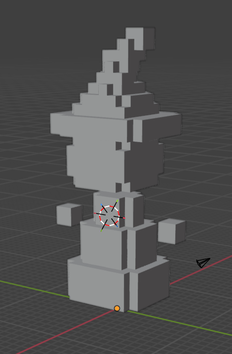
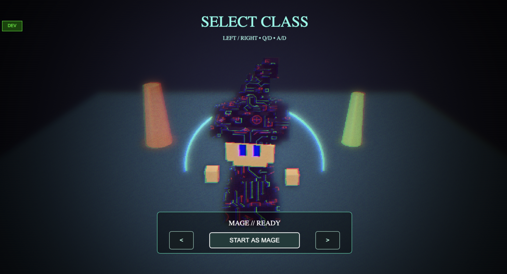
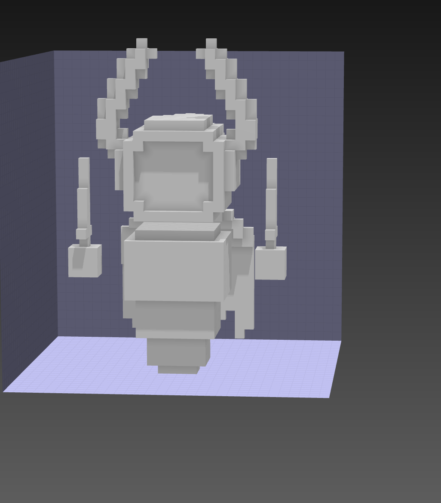
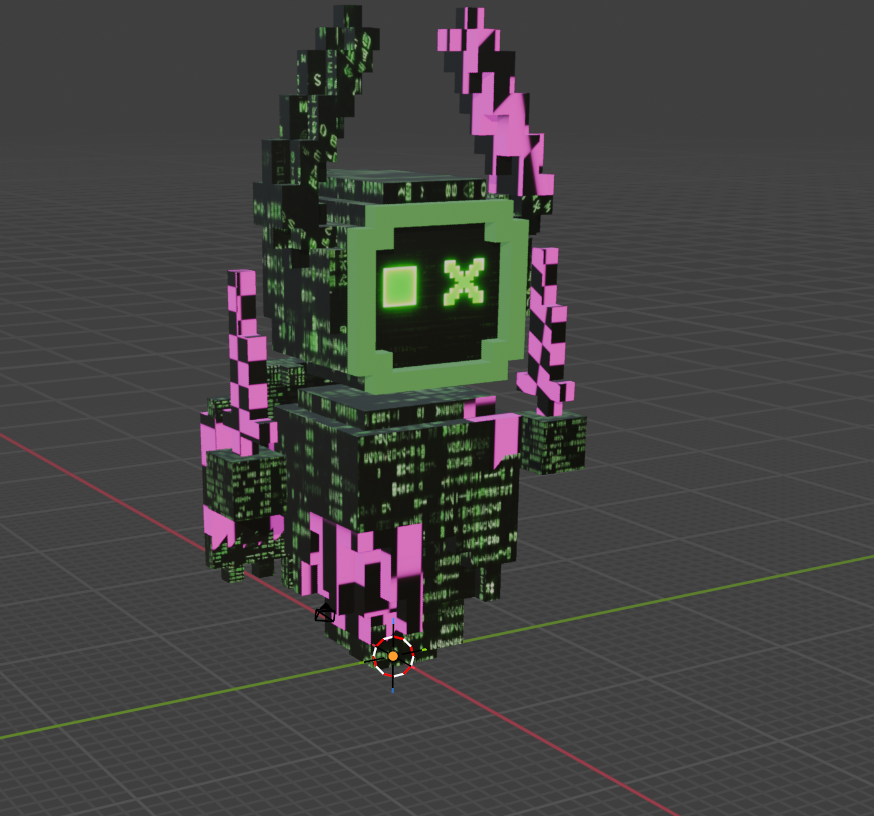
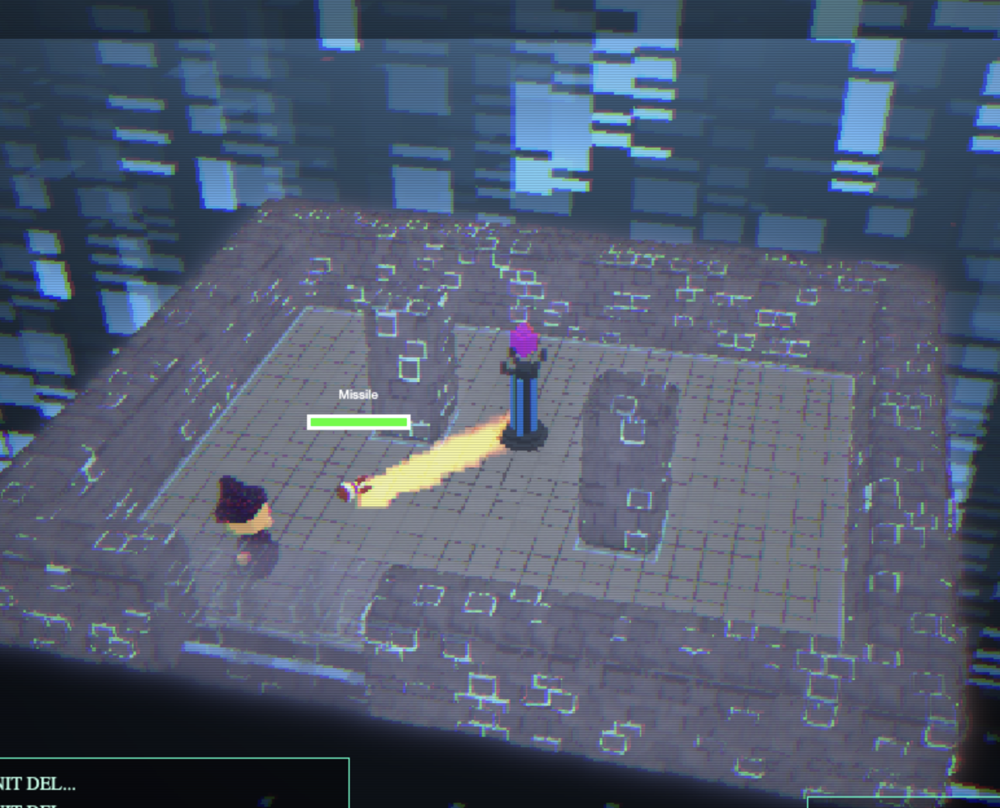
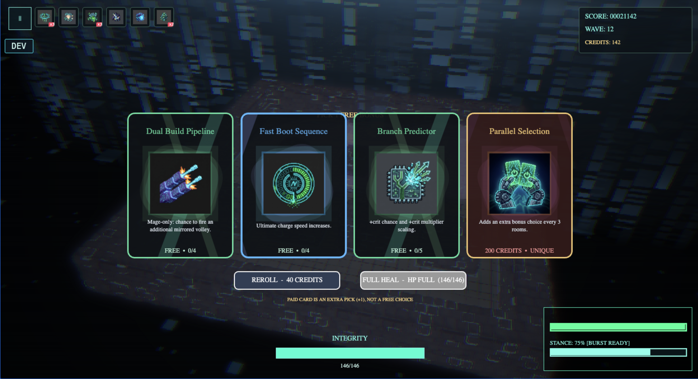

# Making-of Final — Daemon Dungeon
**Rendu final — 31/05/2026**

## Un projet né d’une envie simple
Au départ, l’idée était assez claire: créer un rogue-like arcade lisible, nerveux, et suffisamment “jeu vidéo” pour être immédiatement plaisant, tout en assumant un univers IA fort et cohérent. C’est devenu **Daemon Dungeon**: une simulation corrompue, un joueur qui tente de reprendre le contrôle, et un narrateur hostile qui n’arrête jamais de rappeler qui est censé commander.

Nous ne voulions pas d’un simple décor “futuriste”. Le thème devait vivre dans la mécanique, dans les menus, dans le vocabulaire, dans la pression psychologique en pleine run. C’est pour ça que le Daemon n’est pas un personnage secondaire: c’est une présence active, presque un système de jeu à part entière.

## Une esthétique rétro-informatique assumée
Un autre pilier du projet est la direction visuelle “retro computing”. On a volontairement cherché une sensation de vieille simulation informatique qui se dérègle: rendu très post-processé, grain, scanlines, glitchs, contraste fort, superpositions lumineuses, et UI inspirée des invites de commande.

L’idée n’était pas juste de “faire joli”, mais de créer une nostalgie technique identifiable: on doit avoir l’impression d’entrer dans une machine ancienne, puissante, et un peu hostile. Les titres, les encarts système, les logs affichés en jeu, les popups du Daemon et l’interface terminale servent tous ce même langage visuel.

Ce choix esthétique a aussi orienté l’ergonomie: lisibilité des informations critiques, hiérarchie des couleurs, et feedbacks de combat rapides malgré un habillage volontairement chargé.

## Pourquoi le thème IA n’est pas juste cosmétique
Le cœur du thème, c’est ce renversement: le joueur est “l’utilisateur”, mais l’instance qui parle, commente et sanctionne, c’est le **Daemon**. Le jeu de mot est volontaire: *daemon* au sens processus système, mais aussi *demon* au sens entité hostile.  

L’intro **Takeover** a été pensée comme une porte d’entrée narrative, pas comme un écran d’attente. Elle pose les bases du lore, le ton cynique, et l’idée que tout ce qui suit se passe à l’intérieur d’un système qui vous observe. Ensuite, pendant la run, la narration continue à travers un Director IA contextuel (déclenchements selon la classe, la situation, la progression, les erreurs ou les moments forts). Cette continuité est une des signatures du projet.

## Humour, vocabulaire informatique et fantasy “déguisée”
Une partie de notre plaisir de conception est venue de ce mélange entre fantasy classique et langage système. On a repris des archétypes très lisibles (mage, tank, assassin), mais recodés dans une grammaire informatique: **Wizard Installer**, **Firewall**, **Glitch**.  

La même logique existe partout: dans les noms de bonus, dans les achievements, dans les logs UI, dans les répliques du Daemon. L’idée était de donner au joueur une lecture immédiate (il comprend le rôle “fantasy”), tout en maintenant un habillage narratif cohérent avec une simulation informatique en crise.

Ce ton permet aussi d’introduire un humour un peu acide, parfois absurde, sans casser la tension. Le Daemon se moque, détourne des expressions techniques, et transforme les mécaniques du jeu en “procédures système” comme si la run était un diagnostic en temps réel.

On a aussi glissé des clins d’œil volontaires: une référence à **Buffa** dans la séquence d’introduction, et le classique **“All your base are belong to us”**. Même les interactions cachées gardent ce ton: cliquer l’avatar du Daemon sur l’écran titre pour lui faire changer d’émotion, ou provoquer certaines morts en tutoriel (vide, pics, poison) pour déclencher des réactions spécifiques.

## Une jouabilité pensée d’abord pour clavier+souris
La meilleure expérience reste **clavier + souris**, car le rythme et la précision des engagements sont au centre du fun.  
Cela dit, nous avons tenu à proposer des alternatives crédibles: un mode **keyboard-only** avec auto-aim pour simplifier l’accès, et un support mobile avec joystick virtuel et boutons tactiles. Le mobile fonctionne, mais nous le recommandons plutôt comme mode d’appoint: pour ressentir pleinement le gameplay, la version desktop reste la référence.

Le système de combat commun est volontairement lisible: une attaque principale, une stance à maintenir, une attaque secondaire déclenchée depuis cette stance, puis un ultimate qui structure les pics d’intensité. Ce cadre unifié nous a permis de donner des identités de classe distinctes sans perdre le joueur.

## Le travail de contenu et de rythme
Sur la fin de production, l’enjeu n’était plus d’ajouter “encore une feature”, mais de rendre l’ensemble agréable sur la durée. Baptiste a construit et itéré sur les salles à la main, pendant qu’on consolidait la logique de sélection, la montée de difficulté et la présence de boss.  

Le cycle fin de salle (choix de bonus, achat rare, full heal, reroll) est devenu un vrai nœud de décision: on voulait que la run reste fluide, mais qu’elle propose de vrais arbitrages de risque.

Nous avons aussi fait un choix de design volontaire: ne pas basculer vers une méta-progression envahissante. On voulait conserver une sensation arcade “pick-up-and-play” avec un côté runner: on lance une run tout de suite, sans grind préalable, et on se retrouve immédiatement dans une logique compétitive de meilleur score. La progression passe surtout par la maîtrise, la variété des runs, le codex et les achievements.

## Ce qui a été fait sur les 15 derniers jours
Le plan de J-15 parlait de polish menus, optimisation, portage mobile, bugfix et docs finales. Dans les faits, c’est exactement ce qui a occupé la dernière ligne droite, avec beaucoup d’allers-retours.  

Nous avons poussé une grosse passe d’interface (menus, codex, highscores, écran bonus, game over, HUD), amélioré la lisibilité générale, corrigé les comportements sur ratios d’écran variés, et fiabilisé les interactions scroll/drag. Côté gameplay, les VFX/SFX d’impact ont été enrichis (notamment sur les casters), les tutoriels ont gagné en clarté avec des objectifs persistants, et le Daemon a reçu des variantes de voicelines selon le contexte (tuto depuis menu vs enchaînement vers vraie run).  

En parallèle, on a mené des passes de stabilisation: crashs identifiés, micro-freezes, nettoyage de ressources et de cycles de dispose, et correction de cas qui s’accumulaient pendant les runs.

## Difficultés rencontrées
La difficulté principale n’a pas été “faire marcher une feature”, mais **garder la cohérence** d’un projet qui grossissait vite. Quand on touche en même temps au gameplay, à l’UI, au mobile, à l’audio, au narratif et aux perfs, chaque changement peut en casser un autre.  

Le second défi a été l’équilibre entre ambition et robustesse web. Sur navigateur, surtout dans un contexte itch, la variabilité machine/onglet/navigateur est réelle. Il a fallu choisir des solutions pragmatiques, parfois moins “spectaculaires” techniquement, mais plus sûres en runtime.

## Ce dont on est le plus fiers
On est fiers d’avoir une identité claire: quand on lance Daemon Dungeon, on sent un ton, une intention et une direction artistique cohérente.  
On est fiers aussi du système narratif embarqué en run, qui sert réellement le thème IA au lieu de rester décoratif.  
Et enfin, on est fiers d’avoir convergé vers une expérience jouable et lisible malgré une fin de prod dense: contrôles, tutoriels, HUD, progression, feedbacks, tout tient ensemble.

On est également fiers de l’**ampleur du feature set** livré sur quelques mois: classes distinctes, tutoriels contextualisés, Director AI, codex, achievements, menus complets, UX responsive desktop/mobile, VFX/SFX nombreux, et boucle de progression déjà solide. Tout cela a été développé en parallèle d’un **Master à valider**, donc sans cadence “temps plein studio”.

On assume aussi nos compromis de production: pour tenir le calendrier, certains ennemis déclinent un même socle visuel (notamment sur des familles caster/mobile ou zombie), mais on a investi un soin particulier sur les modèles du joueur, leurs animations et leur lisibilité en combat, pour préserver l’attachement et l’identité des classes.

## Ce qu’il reste à pousser après le rendu
Il reste des axes très concrets pour une version “post-concours”: instrumenter plus finement les performances (CPU/GPU/RAM sur longues sessions), mesurer la rétention pour affiner le fun et l’équilibrage, et connecter un vrai backend leaderboard multijoueur pour comparer les scores en ligne de façon robuste.

Sur l’état actuel, le jeu est globalement fluide sur des PC moyens (hors crashs rares). Sur mobile, le confort est plus limité mais reste jouable. Nous avons fait un choix de ressenti: conserver un gameplay constant, quitte à accepter des chutes de FPS ponctuelles plutôt qu’un ralentissement global de la simulation.

Le document de conception de référence date du **15/05/2026**. Ce making-of sert de mise à jour finale après les deux dernières semaines d’itérations intensives.

## L’équipe
Ce projet, c’est aussi une histoire d’amitié et de parcours partagé. Nous nous sommes rencontrés en double licence maths-info à Valrose. Vlad a poursuivi en école d’ingénieur à Mulhouse. Baptiste et Pierre ont continué ensemble en Master Informatique et passeront en IHM l’an prochain, avec la même envie de construire des projets concrets, vivants et testables.

- **Pierre Constantin** (Master Informatique, UCA Nice/Valrose): programmeur principal, vision artistique globale, architecture, gameplay systems, Director AI, gestion de projet et répartition des tâches.
- **Baptiste Giacchero** (Master Informatique, UCA Nice/Valrose): apprentissage Blender from scratch, modélisation de tous les modèles 3D + animations à la main, testeur principal, lead équilibrage (valeurs joueur/mobs/scaling), level design (création des rooms).
- **Vlad Vasiliev** (école d’ingénieur, Mulhouse; ex double licence maths-info Valrose): chef CI/CD, hébergement initial, design de la page itch.io, designer sonore (recherche + branchement des SFX), support si besoin sur le reste du projet.

Sur un plan plus personnel:
- **Baptiste** est très curieux et touche-à-tout. Ses goûts JV vont de *World of Tanks* à *Genshin Impact*, en passant par *Undertale*.
- **Vlad** est plutôt *Counter-Strike*, musicien, et probablement “le guitariste préféré de votre guitariste préféré”, avec objectivement les meilleurs goûts musicaux... si vous lui laissez le temps de vous expliquer.
- **Pierre** a un faible pour *Overwatch*, joue du piano, et se distingue surtout par une production industrielle de blagues douteuses, qu’il réussit à recycler dans absolument toutes les situations.

En bref: trois passionnés de jeux vidéo qui ont fini par faire le leur.
Et merci à tous les organisateurs du concours de nous avoir permis de transformer notre temps libre en “matière” de master.

## Tester le jeu
La version en ligne est disponible ici: [rolling2k.itch.io/daemon-dungeon](https://rolling2k.itch.io/daemon-dungeon).  
Le dépôt source est ici: [github.com/P13R04/Daemon-Dungeon](https://github.com/P13R04/Daemon-Dungeon).

On conseille de tester aussi en local pour une version plus stable (les conditions web peuvent provoquer des variations de performance, et quelques bugs peuvent subsister).

## Galerie prototypes / avancée

## Vidéos gameplay
Premier lancement (intro + tutoriel): [https://youtu.be/4dlZoZ2nbrA](https://youtu.be/4dlZoZ2nbrA)  
Run Wizard Installer: [https://youtu.be/fB6Nkec43bk](https://youtu.be/fB6Nkec43bk)  
Run Firewall: [https://youtu.be/aRicpye42Mg](https://youtu.be/aRicpye42Mg)  
Run Glitch: [https://youtu.be/aD8-6f1Jxew](https://youtu.be/aD8-6f1Jxew)  
Tour des menus/codex/highscores: [https://youtu.be/xiQRTB9KSlw](https://youtu.be/xiQRTB9KSlw)  
Interactions cachées / easter eggs: à vous de chercher !
